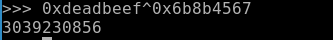
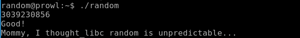
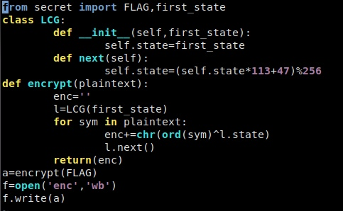
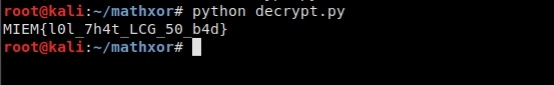

Задачи со случайностями. Автор: Иванов Дмитрий (заголовок)

Как говорил один известный персонаж — «Случайности не случайны». Так и эти задачи из различных CTF-соревнований доказывают, что случайные на первый взгляд числа, на самом деле взяли не случайно.

**Первая задача**

**«Not very random»**

*В этот раз агенту попалось новое послание. Более того, удалось перехватить и программу, которая его сгенерировала.*

*Алгоритм получения шифротекста был бы простым, если бы не использование случайных чисел. К счастью, агент знает, что в момент генерации послания на часах было 2020-10-17T18:46:39+00:00. Помогите ему расшифровать текст.*

*nkbi{k4an0b\_wc0cq\_b9\_oz0x\_6lwamh94ab}*

import random

import time

source = "?????????????????????????????????????"

cipher\_text = ""

seed = int(time.time())

random.seed(seed)

def shift\_in\_alphabet(ch, alphabet\_size, alphabet\_start, shift):

`    `return chr((ord(ch) - ord(alphabet\_start) + shift) % alphabet\_size + ord(alphabet\_start))

for c in source:

`    `if c.islower():

`        `cipher\_text += shift\_in\_alphabet(c, 26, 'a', random.randint(0, 26))

`    `elif c.isdigit():

`        `cipher\_text += shift\_in\_alphabet(c, 10, '0', random.randint(0, 10))

`    `else:

`        `cipher\_text += c

print("Random message: ", cipher\_text)

Изучив работу скрипта, понимаем, что одним из его действий является сдвиг символа в алфавите, причем циклический и главная проблема, что значение смещения случайно.

Однако, в начале кода замечаем, что случайность зависит от времени на устройстве, которое было дано в условии. Выходит, что seed определяется из времени, а из seed’а уже случайные числа.

Переводим дату и время из условия в unix-timestamp, подставляем в seed, меняем значение сдвига на противоположное, запускаем скрипт и получаем флаг.

Флаг: flag{r4nd0m\_sh0ld\_b3\_us3d\_4ccura73ly}

**Вторая задача**

**«random»**

Нажимаем на иконку с подписью random, и нам говорят, что нужно подключиться по SSH с паролем guest.

Так как мы можем прочитать исходный код программы, так как есть право читать для всех, и выполнить с правами владельца программу random (установлен sticky-бит). Давай просмотрим исход код.

Программа генерирует случайное число, применяет операцию XOR (исключающее ИЛИ), и если результат операции XOR равен эталонному значению, выводит флаг.

В данной программе в самом начале используется функция rand(), которая генерирует псевдослучайное число, преобразуя “зерно”, сгенерированное функцией srand(). Функция srand(number) должна вызываться каждый раз перед вызовом rand(). Если такого не происходит, то по умолчанию перед rand() срабатывает srand(1).

Таким образом, в данной программе генератор псевдослучайного числа каждый раз преобразует по одному и тому же алгоритму один и тот же seed”. Нам необходимо узнать число, которое возвращает функция rand(), и проксорить с эталонным значением. Так как операция XOR обратима, то подавая на вход программе полученной значение, мы получим флаг.

Следующим шагом перехватываем данные между библиотечной функцией rand() и нашей программой. Для этого используем утилиту ltrace.

*ltrace ./random*

Мы видим с какими параметрами вызывается функция rand() и какое значение она возвращает. Теперь проксорим это значение с эталонным.

Используем полученное число в нашей программе.

**Третья задача**

**«Хайповая математика»**

Итак, нам дан код, шифрующий флаг и сам шифротекст

Видим, что используется линейный конгруэнтный генератор для получения псевдослучайных чисел, с которыми побайтно ксорится флаг, причем параметры LCG нам известны, не считая начального состояния.Но, к счастью, у нас есть устойчивый формат флага MIEM{}. 

То есть мы знаем первые 5 байт плэйнтекста. Но нам достаточно и одного, чтобы узнать начальное состояние генератора. 

Для этого поксорим первый байт шифротекста и букву 'M'. А дальше остается лишь сгенерировать достаточное количество чисел и расшифровать текст пользуясь тем, что если a^b=c, то a=c^b.

Пример решения на питоне:

