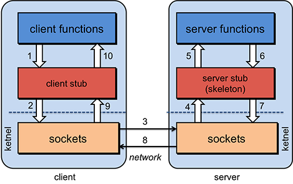
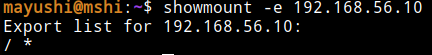

Федеральное государственное автономное образовательное учреждение высшего образования «Московский политехнический университет»

(Московский Политех)

**Статья**

**"Сетевые инструменты разведки сервисов и хостов"**

Выполнил студент

группы 191-351

Пономарев А.А.

2022

**Содержание**

[Сетевые инструменты разведки сервисов и хостов](#_zc8pbd4j6jji)

[Обнаружение хостов](#_7cydkf38lj71)

[Веб-сервисы](#_yjoxapighdlr)

[Arping](#_574tocthm0yn)

[Nmap(опция -sP)](#_qiqot9r6ioh1)

[HPing](#_o1k4yf1kzm5d)

[nslookup](#_ueydvnqse6ka)

[Whois](#_j1qg2x114zu5)

[Traceroute](#_fcvml6tn1mvw)

[NetBIOS host sweep](#_r8zcblobcy1)

[Обнаружение сервисов](#_c24orx7khid2)

[Nmap](#_p39qa0cnc0k6)

[Metasploit Framework](#_72v92xe6xk)

[Burp Suite](#_t1nr4six6j7p)

[Группы сервисов](#_asghsdp2yta2)

[NetBios](#_mwe0pp8pj7fe)

[SMB(Server message block protocol)](#_87yxxrcm1uob)

[RPC](#_sqos1lqyx7t9)

[Полезные заметки](#_ol0a80lnur14)

[Список "well known" сервисов](#_vqa59u8epvlf)
#
#
# Сетевые инструменты разведки сервисов и хостов
Одна из первейших задач при исследовании любой сети — это сократить (иногда довольно большой) набор IP диапазонов до списка активных или интересных хостов. Сканирование каждого порта каждого IP адреса медленно и необязательно. Конечно же то, что делает хост интересным для исследования во многом определяется целями сканирования. Сетевые администраторы возможно будут заинтересованы только в хостах, на которых запущена определенная служба, в то время как тем, кого интересует безопасность, будут интересны все устройства с IP адресами. Задачи администраторов по обнаружению работающих хостов в сети могут быть удовлетворены обычным ICMP пингом, людям же, которые тестируют способность сети противостоять атакам извне, необходимо использовать разнообразные наборы запросов с целью обхода брандмауэра.

## Обнаружение хостов
### Веб-сервисы
**	Есть ряд специализированных ресурсов, позволяющих производить осуществлять разведку OSINT без непосредственного сканирования хоста. Можно выделить следующие преимущества применения веб-сервисов:

- Экономия ресурсов на проведение сканирования. Ряд затратных с точки зрения времени и ресурсов сканирований быстрее осуществить посредством веб-сервисов.
- Сокрытие атакующего. Сканирование осуществляется веб-сервисом, поэтому сканируемый хост будет получать пакеты не от машины атакующего, а от веб-сервиса.

`	`Есть ряд проверенных веб-сервисов, однако функционально они мало чем отличаются друг от друга:

- Shodan.io
- zoomeye.org
- spyse.com
- и т.п.

`	`Наиболее популярным является веб-сервис Shodan, позволяющий просматривать информацию от данных ISP до открытых TCP-портов, сервисов и их уязвимостей

Сервис сам совершает запросы к портам хоста. На изображении ниже показан ответ серверу Shodan от заданного хоста по TCP порту 8080. Определяется статус порта(открыт/закрыт/фильтруется(?)), используемый веб-сервер, ОС хоста.

### Arping
Arping интересен для использования в следующих случаях:

- отправки запросов ARP;
- ICMP на указанный хост и отображения ответов.

Хост может определяться по имени хоста или IP-адресу. Каждый запрос отправляется посекундно. ARP и ICMP являются частью интернет-протокола. ARP используется для сопоставления IPv4-адреса с MAC-адресом, а ICMP используется для отправки информации об ошибках на подключенные IP-адреса, когда пакеты не доставляются и для других целей.

Arping может быть использован для определения доступных хостов без формирования полноценного IP-пакета, добавления записей в arp-таблицу сканируемого хоста.

Этим методом сканирования могут быть обнаружены только компьютеры, находящиеся в одном широковещательном сегменте с хостом, с которого выполняется сканирование. 

`	`Посмотрим применение инструмента

`	`Попробуем совершить arp-запрос к адресу виртуальной машины

`	`Увидим arp-запросы в сети виртуальных машин

В tcpdump на исследуемой машине видим трафик, характерный arp

### Nmap(опция -sP)
Nmap («Network Mapper») - это бесплатная утилита с открытым исходным кодом для обнаружения сети и аудита безопасности. Многие системные и сетевые администраторы также считают его полезным для таких задач, как инвентаризация сети, управление расписаниями обновления служб и мониторинг времени безотказной работы хоста или службы. Nmap использует необработанные IP-пакеты по-новому, чтобы определить, какие хосты доступны в сети, какие услуги (название и версия приложения) эти хосты предлагают, на базе каких операционных систем (и версий ОС) они работают, какой тип фильтров пакетов / брандмауэров используются и десятки других характеристик.

В его основу входит платформа реализации скриптов(NSE, Nmap Scripting Engine) различного назначения, от определения подробностей работающих служб до сканирования уязвимостей, что делает инструмент еще более универсальным.

Благодаря возможности формирования отсылаемых пакетов инструмент является невероятно гибким решением для тестирования систем IPS/IDS.

`	`В рамках обнаружение хостов используется опция -sP. Для каждого указанного хоста из указанного диапазона формируется обычный ICMP-пакет с целью проверки его доступности.

`	`Преимуществом перед обычным ping является возможность указать диапазон адресов.

`	`!Если действует активная система IDS/IPS, ICMP часто отбрасывается с целью скрыть сетевую архитектуру. В данном случае определение работы хоста осуществляется с помощью средств формирования настраиваемых TCP/UDP сегментов для преодоления средств фильтрации трафика.

### HPing
Обычные Ping программы для проверки сетевых соединений используют запросы ICMP и ожидают ответа. Программа hping позволяет вам выполнять такое же тестирование, используя IP-пакеты, включая ICMP, UDP, и TCP.

Hping в своих возможностях аналогичен Netcat: предоставлять контроль над сетевыми протоколами на низком уровне. Но тогда, как Netcat сосредоточен на сетевых соединениях, hping направлен на анализ заголовков протоколов. Он позволяет создавать TCP, UDP, ICMP, raw IP и другие протоколы, которые вам захочется. Программа позволяет манипулировать заголовками, полями, флагами и параметрами. Создавать отдельные пакеты, посылать их в сеть, и анализировать полученный ответ.

Вот основные особенности утилиты hping:

- Тестирование межсетевого экрана
- Расширенное сканирование портов
- Сетевое тестирование, использование разных протоколов, TOS, фрагментация
- Обнаружение MTU
- Расширенная трассировка по всем поддерживаемым протоколам
- Определение следов(fingerprints) ОС
- Дистанционное определение время работы системы и её нагруженности
- Аудит стеков TCP/IP
- hping также может быть полезен студентам, изучающим TCP/IP.

`	`Использование инструмента:

tcpdump исследуемого хоста:

### `	`nslookup
`	`Иногда может возникнуть необходимость проверить работоспособность DNS, посмотреть как быстро работает сервер,

увидеть IP адрес и скорость его получения для определенного домена. Для этого используется утилита nslookup. С помощью нее вы можете не только получить IP адрес по домену, но и выполнить обратное преобразование, а также проверить установлены все необходимые записи DNS.

`	`Прямое разрешение имен dns:

`	`Обратное разрешение имен dns:

### Whois
Whois - невероятно простое, но в тоже время весьма распространенное средство, с помощью которого осуществляется запрос к конкретной базе данных "whois" для получения информации об имени домена и IP-адресе.

Например, мы хотим знать, кто является владельцем IP-адреса 64.58.76.229. Для этого мы посылаем whois-запрос на whois.arin.net.

*bash% whois -h whois.arin.net 64.58.76.229*

*[whois.arin.net]*

*Exodus Communications Inc. Sterling (DC2) (NETBLK-EC17-1) EC17-1*

`                                                `*64.58.64.0 - 64.58.95.255*

*Yahoo (NETBLK-EC17-1-YAHOO1)    EC17-1-YAHOO1   64.58.76.0 - 64.58.79.255*

*To single out one record, look it up with "!xxx", where xxx is the handle, shown in* 

*parentheses following the name, which comes first.*

*The ARIN Registration Services Host contains ONLY Internet Network Information:* 

*Networks, ASNs, and related POCs.*

*Please use the whois server at rs.internic.net for DOMAIN related Information and* 

*whois.nic.mil for NIPRNET Information.*

`	`Запрос к DNS-серверу whois.arin.net определил пул адресов, в котором находится адрес хоста, за какой компанией числится данный адрес и кто является зарегистрировавшим 

### `	`**Traceroute**
Traceroute размечает маршрут, который проходят IP-пакеты на пути от хоста до указанной цели.

Программа начинает работать с отсылки IP-пакета (ICMP или UDP) к заданной цели, но при этом устанавливает время жизни пакета ( TTL- Time-To-Live ) равным 1. Пакет исчерпывает свои ресурсы при достижении первой же промежуточной точки, и маршрутизатор уведомляет нас с помощью ICMP-сообщения, что время жизни пакета исчерпано, сообщая тем самым, что достигнута первая промежуточная точка. Теперь мы отсылаем следующий IP-пакет к цели, но теперь уже устанавливаем параметр TTL равным 2. Пакет достигает второй промежуточной точки и происходит тоже самое. Продолжая наращивать параметр TTL до тех пор, пока не будет достигнута цель, мы сможем узнать, какой маршрут проходят пакеты на пути от нашего хоста до цели.

Этот инструмент может быть очень полезен при диагностике проблем в сети (для определения причин выхода сети из строя или для определения петель), но он также может быть использован для получения информации о местонахождении тестируемой системы.

Ниже приведен фрагмент вывода, который можно получить, используя команду traceroute

Здесь приведено несколько последних промежуточных точек маршрута на пути к цели. Часть базовых хостов сети интернет используют имена, отражающие их географическое положение. Вероятно, что комбинация символов SEA1 имеет отношение к Сиэтлу, штат Вашингтон. Это говорит о том, что данная машина, возможно, расположена на северо-западе Соединенных Штатов.
### NetBIOS host sweep
Благодаря тому, что NetBIOS может использовать UDP в качестве транспорта, скорость его работы позволяет обнаруживать хосты в очень больших сетях.

Инструмент *nbtscan* может всего за 2 секунды разрешить(определить) адреса сети вида 192.168.0.0/16, тогда как традиционное TCP-сканирование займет десятки минут. Эту особенность можно использовать как технику обнаружения хостов (host sweep) в очень больших сетях, о которых ничего не известно, перед тем как запускать nmap. Хотя результат и не гарантирует 100% обнаружения, т. к. преимущественно отвечать будут windows-хосты и то не все, он всё же позволит определить, в каких примерно диапазонах находятся живые хосты.

Польза инструмента также определяется разрешением адреса хоста и его NetBIOS-имени. Наличие NetBios имени может говорить о работающих сервисах на базе протоколов SMB или RPC,

`	`Можем видеть получение NetBIOS имени исследуемой машины

`	`Вывод "Permission denied" говорит о запрете отправки ответов NetBIOS-имени по протоколу NetBIOS.
## Обнаружение сервисов
### `	`**Nmap**
При проведении сканирования сети и служб конкретных хостов, можно выделить наиболее часто встречающиеся опции при работе с nmap:

- -sC. Опция -sC или --script=default позволяет получить общую информацию об открытых портах и их службах(\*Только для популярных портов и служб. Определены в nmap -top-ports). Информация обычного сканирования и при использовании опции -sC можно рассмотреть на примере скана стандартного порта ftp-сервера 21, которая позволила определить наличие функции анонимного доступа к ftp-серверу.

nmap -p21 192.168.56.10   	 

PORT   STATE SERVICE

21/tcp open  ftp

MAC Address: 08:00:27:C0:F6:92 (Oracle VirtualBox virtual NIC)

Nmap done: 1 IP address (1 host up) scanned in 0.63 seconds

-@-:~$ sudo nmap -sC -p21 192.168.56.10

PORT   STATE SERVICE

21/tcp open  ftp

|\_ftp-anon: Anonymous FTP login allowed (FTP code 230)

| ftp-syst:

|   STAT:

| FTP server status:

|  	Connected to 192.168.56.1

|  	Logged in as ftp

|  	TYPE: ASCII

|  	No session bandwidth limit

|  	Session timeout in seconds is 300

|  	Control connection is plain text

|  	Data connections will be plain text

|  	vsFTPd 2.3.4 - secure, fast, stable

|\_End of status

MAC Address: 08:00:27:C0:F6:92 (Oracle VirtualBox virtual NIC)

Nmap done: 1 IP address (1 host up) scanned in 0.63 seconds

- -sV. Определение запущенных на открытых портах сервисов и их версий

-@-:~$  nmap 192.168.56.10

PORT 	STATE	SERVICE

21/tcp	open	ftp

...

-@-:~$  nmap -sV 192.168.56.10

PORT	STATE	SERVICE	VERSION

21/tcp	open	ftp	vsftpd 2.3.4

...

- -O. Определение ОС и её версии

-@-:~$ sudo nmap -O 192.168.56.10

...

Running: Linux 2.6.X

OS CPE: cpe:/o:linux:linux\_kernel:2.6

OS details: Linux 2.6.9 - 2.6.33

...

- -A. Определение ОС и её версии, сканирование с помощью скриптов и определение пути до хоста(traceroute).

В зависимости от задач использования nmap учитывается степень агрессивности и анонимности осуществляемых действий. К примеру, если при проведении тестирования на проникновение команде атакующих необходимо остаться незамеченной, обойдя системы фильтрации трафика или системы защиты от вторжений, то системному администратору, проводящему ревизию работающих хостов и работающих на них служб, задачи поставлены другие. Различные способы использование функционала nmap определяет и его различные опции.

### Metasploit Framework
`	`Хоть в основе инструмента сканирования хостов и лежит ранее упомянутый nmap, вывод представляется в удобном представлении графического окружения.

Сканирование можно разделить на четыре отдельных этапа:

- Ping сканирование. Обнаружение alive-хостов(nmap -sP)
- Сканирование портов. Определение открытых портов и их служб(nmap -sV)
- Определение ОС и её версии(nmap -O)
- Импорт данных. Генерация отчета и представление в окне программы.

`	`Важно отметить, что могут применяться те же опции сканирования, что и при работе с консольной утилитой nmap(так как само сканирование и построено на nmap)

`	`Кроме этого могут применяться опции попытки авторизации в обнаруженных сервисах SMB.

`	`Получаемая информация по результатам сканирования:

- ip-адрес;
- Hostname;
- Версия ОС;
- Активные сервисы;
- Последнее время обновления хоста;
- Статус хоста.

### Burp Suite
Burp Suite — профессиональная программа для тестирования, анализа и аудита веб-приложений, анализа данных которые передаются между клиентом и сервером. Burp Suite — это многофункциональный сквозной прокси-сервер для Linux/Windows/MacOS платформ.Программа завоевала популярность по всему миру и используется пентестерами, специалистами по кибербезопасности Google, Amazon, Oracle, Apple, Microsoft, Samsung.

`	`Среди наиболее полезных функциональных особенностей можно отметить перехват входящего и исходящего трафика с помощью прокси-сервера Burp Suite. Это поможет определить входящие запросы, а также просматривать и формировать исходящие.

Перехват трафика посредством прокси:

Просмотр истории запросов:

`	`Для обеспечения работы инструмента необходимо перенаправлять трафик приложения на прокси-сервер Burp Suite.

## Группы сервисов
Рассматриваются протоколы, используемые на их базе сервисы и способы обнаружения работы данных сервисов.
### NetBios
Приложения могут найти через NETBIOS нужные им ресурсы, установить связь и послать или получить информацию. NETBIOS использует для службы имён порт 137, для службы дейтаграмм — порт 138, а для сессий — порт 139.

Протокол NetBios позволяет узнать о сканируемом хосте ряд сведений:

- Наличие развернутых сервисов smb;
- Имена NetBios-типов хоста;
- Определение принадлежности к домену.

### SMB(Server message block protocol)
**SMB**, или иначе[**CIFS**](https://smb-conf.ru/cifs.html)(для Windows NT 4.0) — это протокол, определяющий сетевую файловую систему, ее структуру и порядок использования. NetBIOS предоставляет интерфейс, через который SMB-сообщения передаются в сети, он используется серверами для "анонса" служб в сети, и клиентами для "обзора" этих служб.

Как и Windows, имеющая средства доступа к разделяемым ресурсам из командной строки посредством SMB, у Unix есть собственные средства доступа к общим ресурсам на основе протокола NetBIOS. Samba включает в себя возможности и сервера и клиента для того, чтобы предоставить вам возможность определить общие сетевые ресурсы таким образом, чтобы Windows-клиенты могли видеть их в своем сетевом окружении и получить к ним доступ.

Работа с протоколом организуется с помощью утилиты *net.* Так как утилита административная, в рамках обнаружения необходимой информации о развернутых SMB сервисах интересны опции *"net view"* *.*

***net view***. net view дает возможность получить информацию по двум ключевым моментам. Во-первых, задав имя домена или рабочей группы, можно увидеть все другие компьютеры, входящие в домен или рабочую группу. Затем можно использовать второй режим работы net view, для определения общих сетевых ресурсов на каждом хосте или в сети. 

*C:\WINDOWS\Desktop>net view /WORKGROUP: myworkgroup*

*Servers available in workgroup MYWORKGROUP.*

*Server name                 Remark*

*---------------------------------------------------------------------*

*\\BADMAN                    The bad machine*

*\\BROCCOLI                  Veggies are god for you*

*\\TECHSUPP                  Don't call as - we call you*

*The command was completed successfully*

*C:\WINDOWS\Desktop>net view \\badman* 

*Shared resources at \\BADMAN*

*Sharename       Type        Comment*

*--------------------------------------------------------------------*

*CDRW        Disk*

*D       Disk*

*HALF-LIFE   Disk*

*INSTALL     Disk*

*MP3S        Disk*

*The command was completed successfully*

***net use.*** Осуществляет подключение к удаленному ресурсу, используемому сервис на базе протокола SMB.

***Smbclient*.** Smbclient можно представить себе, как аналог FTP-клиента для доступа к общим ресурсам на основе протокола SMB. Smbclient это практически тоже самое, что и *net use* под Windows.

Например, с помощью smbclient мы можем получить список доступных общих сетевых ресурсов, обратившись к хосту либо по адресу, либо указав его NetBIOS имя:

[-@- ~]$ smbclient -N -L badman -I 192.168.1.101

Added interface ip=192.168.1.101 bcast 192.168.1.255 nmask=255.255.255.0 

Sharename       Type        Comment

\---------       ----        --------

MP3S            Disk

HALF-LIFE       Disk

CDRW            Disk

INSTALL         Disk

D           Disk

IPS$            IPC         Remote Inter Process Communications

Server          Comment

\---------       ---------

BADMAN          The bad machine

Workgroup       Master

\---------       ---------

MYWORKGROUP     BADMAN

### RPC
**Удаленный вызов процедур (RPC)** — это метод межпроцессного взаимодействия. Используется для клиент-серверных приложений. Механизмы RPC используются, когда компьютерная программа вызывает выполнение процедуры или подпрограммы в другом адресном пространстве, которое закодировано как обычный вызов процедуры, при этом программист специально не кодирует детали для удаленного взаимодействия. 

Этот вызов процедуры также управляет транспортным протоколом низкого уровня, таким как протокол пользовательских дейтаграмм, протокол управления передачей / Интернет-протокол и т. д. Он используется для передачи данных сообщения между программами. Полная форма RPC — Удаленный вызов процедур.

`	`Работа RPC представлена ниже.

`	`Наиболее часто используемы реализации протокола RPC - OpenRPC для Unix-систем и MSRPC для Windows NT-систем.

Инструменты обнаружения RPC:

- rpcinfo
- nmap
- rlogin
- showmount

`	`Инстурмент для поиска информации об RPС-сервисах - rpcinfo.

`	`Определение сервисов RPC на исследуемой машине:

Определение RPC-служб с помощью nmap: nmap -sR <host> (!Активируется по умолчанию с опцией -sV)

Обнаружение rhosts-сервиса удаленного предоставления оболочки(аналог ssh):

Обнаружение экспортов NFS c помощью showmount:

## Полезные заметки
### Список "well known" сервисов
`	`Файл "nmap-services" определяет список всех известных сервисов и закрепленных за ними портов(!файл располагает значениями портов по умолчанию).

`	`Ссылка - https://nmap.org/book/nmap-services.html

