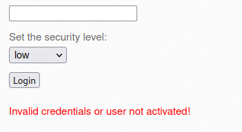

Начало начал – сканирование. Автор: Щипунов Тимофей (заголовок)

`	`Nmap ("Network Mapper") - это бесплатная утилита с открытым исходным кодом для обнаружения сети и аудита безопасности. Многие системные и сетевые администраторы также находят его полезным для таких задач, как инвентаризация сети, управление расписаниями обновления служб и мониторинг времени безотказной работы хоста или службы. Nmap использует необработанные IP-пакеты новыми способами, чтобы определить, какие хосты доступны в сети, какие услуги (имя приложения и версия) предлагают эти хосты, какие операционные системы (и версии ОС) они используют, какой тип фильтров пакетов / брандмауэров используются, и десятки других характеристик. 

`	`Он был разработан для быстрого сканирования больших сетей, но прекрасно работает против отдельных хостов. Nmap работает во всех основных компьютерных операционных системах, а официальные двоичные пакеты доступны для Linux, Windows и Mac OS X. В дополнение к классическому исполняемому файлу Nmap из командной строки, Nmap suite включает расширенный графический интерфейс и средство просмотра результатов (Zenmap), гибкое средство передачи данных, перенаправления и отладки (Ncat), утилиту для сравнения результатов сканирования (Ndiff) и средство генерации пакетов и анализа ответов (Nping)..

`	`Существует ряд причин, по которым специалисты по безопасности предпочитают Nmap другим инструментам сканирования.

`	`Во-первых, Nmap помогает вам быстро составить карту сети без сложных команд или конфигураций. Он также поддерживает простые команды (например, для проверки работоспособности хоста) и сложные сценарии с помощью скриптового движка Nmap.

`	`Другие функции Nmap включают:

`	`Возможность быстрого распознавания всех устройств, включая серверы, маршрутизаторы, коммутаторы, мобильные устройства и т.д., в одной или нескольких сетях.

`	`Помогает идентифицировать службы, запущенные в системе, включая веб-серверы, DNS-серверы и другие распространенные приложения. Nmap также может обнаруживать версии приложений с достаточной точностью, чтобы помочь обнаружить существующие уязвимости.

`	`Nmap может найти информацию об операционной системе, запущенной на устройствах. Он может предоставлять подробную информацию, такую как версии ОС, что облегчает планирование дополнительных подходов во время тестирования на проникновение.

`	`Во время аудита безопасности и сканирования уязвимостей вы можете использовать Nmap для атаки на системы с использованием существующих сценариев из Nmap Scripting Engine.

`	`Nmap имеет графический пользовательский интерфейс под названием Zenmap. Это поможет вам разработать визуальные отображения сети для улучшения удобства использования и отчетности.

`	`Давайте проведем сканирование сети, идентифицируем открытые порты, версии сервисов, ОС.

sV- сканирует один хост на наличие 1000 известных портов. Эти порты используются популярными сервисами, такими как SQL, SNTP, apache и другими.

Ping scan — сканирует список устройств, запущенных в данной подсети.

Сканировать можно не только IP, но и доменные имена. Nmap имеет агрессивный режим, который позволяет обнаруживать ОС, определять версии, сканировать сценарии и трассировать маршрут. Вы можете использовать аргумент -A для выполнения агрессивного сканирования.

Вы можете сканировать несколько хостов с помощью множества подходов:

Запишите все IP-адреса в одну строку, чтобы сканировать все хосты одновременно.

\> nmap 192.168.1.2 192.168.3.2 192.168.0.2

Используйте звездочку (\*) для одновременного сканирования всех подсетей.

\> nmap 192.168.23.\*

Добавьте запятые для разделения окончаний адресов вместо ввода целых доменов.

\> nmap 192.168.123.4,8,54,78

Используйте дефис для указания диапазона IP-адресов

\> nmap 192.168.115.0–255

Заключение:

`	`Nmap, несомненно, является “швейцарским ножом” для анализа сетей, благодаря своему арсеналу универсальных команд.

`	`Он позволяет вам быстро сканировать и находить необходимую информацию о вашей сети, хостах, портах, брандмауэрах и операционных системах.

`	`Nmap имеет множество настроек, флагов и предпочтений, которые помогают системным администраторам детально анализировать сеть.

Brute-force-атака с помощью BurpSuite. Автор: Щипунов Тимофей (заголовок)

Атака методом перебора - это метод взлома, который использует метод проб и ошибок для взлома паролей, учетных данных для входа и ключей шифрования. Это простая, но надежная тактика для получения несанкционированного доступа к индивидуальным учетным записям и системам и сетям организаций. Хакер пробует несколько имен пользователей и паролей, часто используя компьютер для тестирования широкого спектра комбинаций, пока не найдет правильную регистрационную информацию.

Название "грубая сила" происходит от того, что злоумышленники используют чрезмерно энергичные попытки получить доступ к учетным записям пользователей. Несмотря на то, что это старый метод кибератак, атаки методом перебора опробованы и остаются популярной тактикой среди хакеров.

Существуют различные типы методов атаки методом перебора, которые позволяют злоумышленникам получить несанкционированный доступ и украсть пользовательские данные.

Типы атак грубой силой:

\1. Простые атаки грубой силой

Простая атака методом перебора происходит, когда хакер пытается угадать учетные данные пользователя для входа вручную без использования какого-либо программного обеспечения. Обычно это делается с помощью стандартных комбинаций паролей или кодов личного идентификационного номера (PIN). 

Эти атаки просты, потому что многие люди все еще используют слабые пароли, такие как "password123" или "1234", или практикуют неправильный этикет паролей, например, используют один и тот же пароль для нескольких веб-сайтов. Пароли также могут быть угаданы хакерами, которые проводят минимальную разведывательную работу, чтобы взломать потенциальный пароль пользователя, например название его любимой спортивной команды.

\2. Словарные атаки

Атака по словарю - это базовая форма взлома методом грубой силы, при которой злоумышленник выбирает цель, а затем проверяет возможные пароли на соответствие имени пользователя этого человека. Сам по себе метод атаки технически не считается атакой методом перебора, но он может сыграть важную роль в процессе взлома паролей злоумышленником. 

Название "словарная атака" происходит от того, что хакеры просматривают словари и исправляют слова специальными символами и цифрами. Этот тип атаки обычно отнимает много времени и имеет низкие шансы на успех по сравнению с более новыми, более эффективными методами атаки.

\3. Гибридные атаки грубой силой

Гибридная атака методом перебора - это когда хакер сочетает метод атаки по словарю с простой атакой методом перебора. Все начинается с того, что хакер знает имя пользователя, затем проводит атаку по словарю и простыми методами перебора, чтобы обнаружить комбинацию входа в учетную запись. 

Злоумышленник начинает со списка потенциальных слов, затем экспериментирует с комбинациями символов, букв и цифр, чтобы найти правильный пароль. Такой подход позволяет хакерам обнаруживать пароли, которые сочетают общие или популярные слова с цифрами, годами или случайными символами, такими как "SanDiego123" или "Rover2020".

\4. Обратные атаки грубой силой

При обратной атаке методом перебора злоумышленник начинает процесс с известного пароля, который обычно обнаруживается при взломе сети. Они используют этот пароль для поиска подходящих учетных данных для входа, используя списки из миллионов имен пользователей. Злоумышленники могут также использовать часто используемый слабый пароль, такой как "Password123", для поиска совпадения в базе данных имен пользователей.

\5. Заполнение учетных данных

Вброс учетных данных основывается на слабом этикете паролей пользователей. Злоумышленники собирают украденные ими комбинации имени пользователя и пароля, которые затем тестируют на других веб-сайтах, чтобы узнать, могут ли они получить доступ к дополнительным учетным записям пользователей. Этот подход успешен, если люди используют одну и ту же комбинацию имени пользователя и пароля или повторно используют пароли для различных учетных записей и профилей в социальных сетях.

`	`Чтобы провести вышеописанную атаку, воспользуемся программой Burp Suite - это интегрированная платформа и графический инструмент для выполнения тестирования безопасности веб-приложений, он поддерживает весь процесс тестирования, от первоначального отображения и анализа поверхности атаки приложения до поиска и использования уязвимостей в системе безопасности.

Попробуем подобрать пароль в данной форме. Введем любое значение, и попробуем отловить пакет.

После того как мы поймали пакет, отправляем его в intruder

Burp Intruder работает, принимая HTTP-запрос (называемый "базовым запросом"), изменяя запрос различными систематическими способами, выдавая каждую измененную версию запроса и анализируя ответы приложения для выявления интересных функций.

Для каждой атаки вы должны указать один или несколько наборов полезных нагрузок и позиции в базовом запросе, где должны быть размещены полезные нагрузки. Доступны многочисленные методы генерации полезных нагрузок (включая простые списки строк, чисел, дат, перебор, переключение битов и многие другие). Полезные грузы могут быть размещены в позиции полезной нагрузки с использованием различных алгоритмов. Доступны различные инструменты, помогающие проанализировать результаты и выявить интересные элементы для дальнейшего изучения.

Далее, начинаем перебор логинов и паролей.

Когда найдется верная УЗ, у нее будет 302 status, что значит произошел вход.
